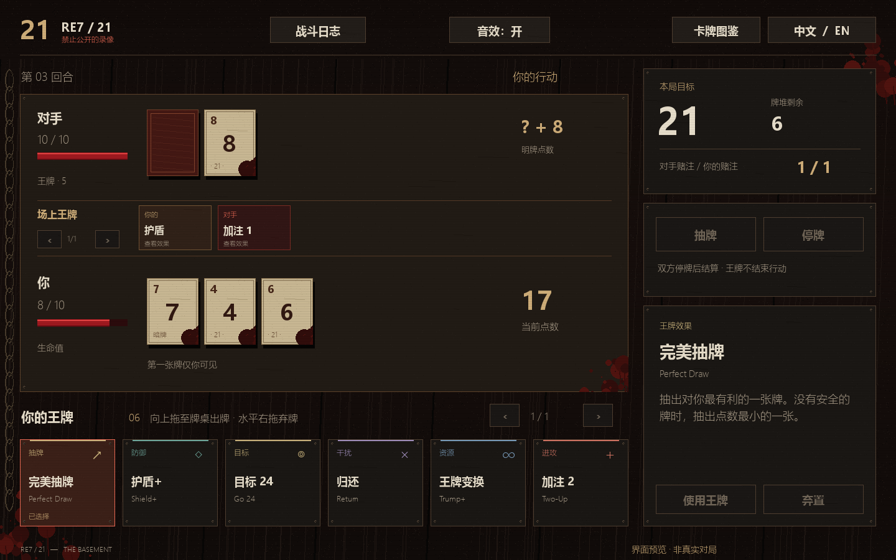

# RE7 / 21 — NOIR

[中文](README.md) | **English**

An unofficial desktop card game inspired by **Resident Evil 7: 21**. Share a unique 1–11 number deck, hide your opening card and use trump cards to change the stakes. The original project's card rules are preserved, with a dark table, bilingual UI and editable game presets.

[**Download for Windows**](https://github.com/404elf/RE7_21_Noir/releases/latest) · [Report an issue](https://github.com/404elf/RE7_21_Noir/issues) · [Changelog](CHANGELOG.md)

## Start playing

1. Download **RE7-21-Windows.zip** from Releases and extract the whole archive.
2. Run **RE7_21_Noir.exe** and choose an AI match. No Python installation is needed.
3. Click a trump to inspect it, drag it onto the table to play, or drag right to discard. HIT and STAY hand over the turn.

Chinese is the default; use the game's 中文 / EN button to switch. Keep the executable beside its folders.

## Features

- Multiple AI difficulties and conservative, gambler and swing styles; a separate nightmare challenge uses public clues and its own hand.
- LAN discovery, direct address, room codes and saved self-hosted servers. Room codes need a deployed server; no public server is preconfigured and automatic NAT traversal is not included. See [network setup](NETWORKING.md).
- Editable presets, random configurations and per-field random locks. Randomisation preserves the target, which defaults to 21.
- Time presets, unlimited timing and custom limits. Only explicit HIT / STAY grant an increment. With timing enabled, each player's first move each round has a separate 30-second preparation period; expiry forfeits the match.
- Relative You / Opponent logs, visible showdown cards, rematch, surrender and draw offers. Manual card inspection takes priority over opponent notifications.

## Customisation

Use **Game settings** for rules, trump weights and audio. Use **Time control → Custom** for clocks, preparation and reveal delays. Rules apply to the next match; audio applies immediately.

The Windows package groups editable files under `custom/`: `game/`, `presets/`, `timer/`, `audio/` (including sounds), and `network/`. Logs, backups and updates are in `userdata/`; help is in `docs/`.

Paste the [AI configuration guide](docs/AI-CONFIG-GUIDE.md) into a chat AI with your requirements. Save its JSON response in `custom/presets/`, refresh the preset list, select it and save. The guide's keys and output contract are language-independent; you may ask the AI in English. Locks apply to randomisation during the current editing session; manual edits and deliberately selecting another preset still work.

## Updates and feedback

Use **Manual update** in the lobby. Downloads are verified and installed separately, retaining the previous installation and custom files. Legacy files are backed up before migration. `RE7_21_Noir-Windows.zip` is the compatibility asset for old updaters; new players should choose **RE7-21-Windows.zip**.

Both clients and room servers must update to v1.5.0 because the timing protocol changed.

Feedback: **1543738958@qq.com**. Include the version, reproduction steps and, if available, the relevant `userdata/logs/` file.

This is a fan project, unaffiliated with CAPCOM. Resident Evil names belong to their owners. Offline AI play requires no network connection.

Source setup: Python 3.12, install `requirements.txt`, then run `python main.py`. Source files retain their development layout. Test reports remain in the repository, not the player download.

## Updates

**v1.5.1**: AI matches use separate local ports to avoid startup conflicts. Add 1 / 2 now only raise the bet, without drawing a bonus trump. Harvest remains a separate effect.

**v1.5.0**: interruptible card details, relative logs, numeric-trump draw-order fix, independent opening preparation, time presets, random locks, a chat-AI configuration guide and a cleaner Windows package. Includes v1.4.5's wait-when-certainly-ahead strategy.

[Previous releases →](CHANGELOG.md)
