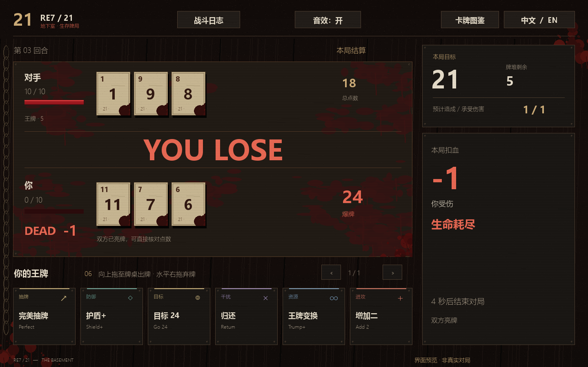
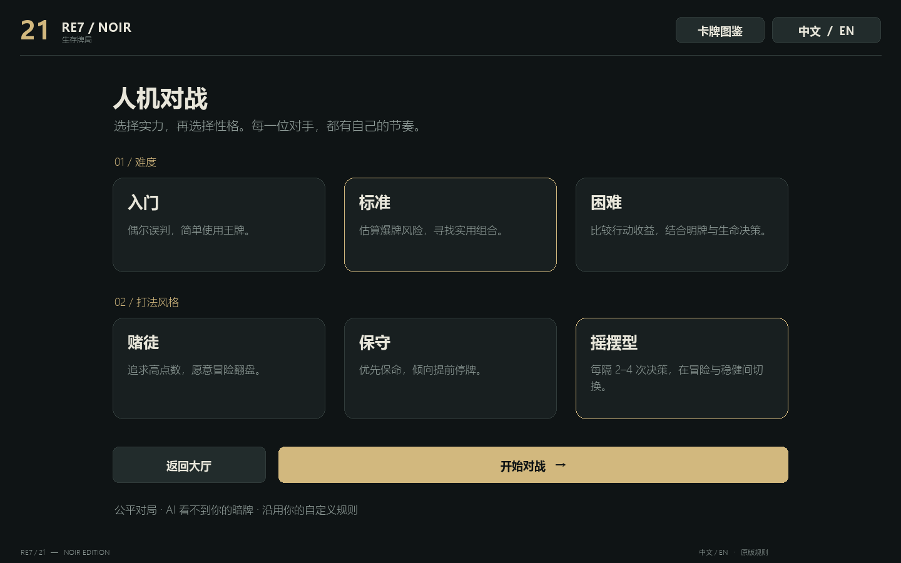
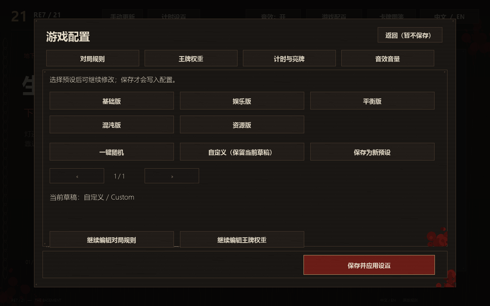

## 1.3.8 游戏内配置编辑器

在大厅或人机设置页点击右上角“游戏配置”。分为对局规则、王牌权重、计时与亮牌、音效音量四类；点击数值直接输入，支持 Ctrl+A、退格、回车确认和 ± 微调。王牌权重为 0 表示禁用，已启用牌优先排列。

点击“保存设置”写入相应 JSON。规则与王牌权重属于同一文件，会一并保存；计时和音量分别保存。规则、计时用于下一场房主/人机对局，无需重启游戏；音量立即生效。关闭面板保留未保存草稿，但退出游戏会丢弃草稿。对局过程中不开放规则编辑。

每次保存先在 config-backups 中备份原文件并校验，然后原子替换。数值越界、牌堆不足四个点数、外部修改冲突会阻止保存。JSON 中原有注释字段和未知字段会保留。音效自定义文件路径仍由 audio.json 配置。

## 1.3.7 卡牌动画

开局依次发牌、数字牌从牌堆滑入手牌、确认使用的王牌落桌并淡出、弃牌向右旋转离场、结算翻开对手暗牌。动画约 0.4 秒，不暂停计时或阻止下一步操作；收到服务器确认后才播放出牌动画。重复状态不重复播放，不会提前显示对手暗牌。

## 1.3.6 结算、血量与场上王牌

- 两排手牌之间显示大字 YOU WIN / YOU LOSE / DRAW，保留配置的结算等待；不遮挡牌面。当前结算不再默认展示长篇解释。
- 血红血条带静态滴血，扣血大字显示，归零显示 DEAD；累计血迹加重。
- 移除牌背菱形，计时改成无边框读数与行动指示。
- 图鉴未启用牌灰显并标注“未启用”，仍可查看说明。
- 场上王牌以双方不同底色的小卡片展示，可点击查看效果，手动翻页，不再自动轮换。
- 对手新出王牌依次在侧栏展示名称和说明，每张约 4 秒，可点“知道了”关闭；对局和计时不会暂停。

## 1.3.5 实机试玩调整

实机人机对局验证了拖动出牌、水平弃牌、停牌结算和下一局回看。场上效果改为更清楚的标签；牌桌底部显示最近一次公开操作。累计血迹避开两侧血量、点数和计时区域；亮牌时不再显示“仅你可见”。

## 1.3.4 图鉴与伤害反馈

图鉴按当前抽取配置将已启用牌排在前面，概率为 0 的牌排在后面，组内保持原有顺序。对局中使用房主同步的配置，大厅使用本地配置；支持数字牌概率与 Return+ / ADD2+ 名称对应。

双方实际扣血会在各自半边牌桌累积血迹，回血不会擦掉，新一场比赛会清空。血迹在牌和文字下方绘制。扣血音效现在对双方伤害都触发，并使用独立音效通道，避免被结算声盖掉；仍可在 audio.json 的 damage 项调节或关闭。

## 1.3.3 拖牌与亮牌结算

拖动时移动卡牌本体，保留鼠标抓取位置与原卡样式；不再显示“松手出牌”提示框。取消中央结算弹窗与全屏变暗，双方手牌始终可见。结果在右侧展示双方牌面点数、目标、伤害及胜负原因。亮牌默认 3 秒，`timer.json` 的 `settlement_seconds` 仍可设为 0–60。进入下一局后仍保留上一局详情；查看王牌时可点“回看上一局”返回。游戏规则保持不变。

## 1.3.2 操作与音效更新

- 王牌向上拖进牌桌，松手打出；水平向右拖动至少 100 个界面像素，松手弃置。松手前显示提示，拖回原位或按 Esc 取消。点击查看详情与原有按钮仍可使用。
- 双方剩余时间移至各自点数下方，放大显示；删除“棋钟”措辞，牌背去除问号。
- “对局选项”中确认投降，或申请平局。对手同意后整场平局；等待期间继续计时，每人每回合限申请一次。AI 在生命值不领先时接受平局，领先时拒绝。
- 结算默认等待 1 秒。在 `timer.json` 中修改 `settlement_seconds`（0–60），设为 0 取消等待；重启或在计时设置中读取自定义后，对下一场房主对局生效。
- 默认音效换为原创地下室风格的纸张摩擦、机械撞击和低频余响，不使用原游戏录音。`audio.json` 可逐项替换文件、调音量或关闭；新音效位于 `sounds/basement`。

# RE7 · 21 — NOIR

基于 [404elf/RE7_21](https://github.com/404elf/RE7_21) 的独立改版。深色绿牌桌、中英切换、人机、音效、可选棋钟、局内日志和手动更新。1.3.0 保留原卡牌运算，在新的对局调度层加入计时与日志。




1.3.1「地下室」主题：焦黑木纹、锈蚀金属、干涸血迹、旧纸牌、暗红按钮与轻微扫描线。所有纹理由程序独立生成并缓存，不读取外部图片、不消耗游戏随机数。保留人机、联机、计时、音效、日志、更新与中英切换。旧版本仍在原目录；新版位于 `dist/v1.3.1/`。

## 开始游戏

Windows 用户可直接运行打包目录中的 `RE7_21_Noir.exe`。同目录下的 `config.json` 由房主加载。

源码运行：安装 Python 3.12 或更新版本，然后双击 `start.cmd`。首次会在本目录建立虚拟环境并安装唯一运行依赖 pygame-ce。也可手动运行：

```powershell
python -m venv .venv
.venv/Scripts/python.exe -m pip install -r requirements.txt
.venv/Scripts/python.exe main.py
```

1. 房主点击「创建房间」。
2. 对手输入房主的局域网 / 虚拟组网 IP，点击「加入房间」。同机测试使用 `127.0.0.1`。
3. 点击「抽牌」或「停牌」。选择王牌后，右侧分别提供「使用王牌」和「弃置」。弃置不触发效果，也不结束行动。
4. 双方停牌后自动结算；游戏结束后双方同意即可再来一局。

右上角切换语言或打开全部 48 张王牌的图鉴。手牌超过 6 张可翻页；窗口可缩放，建议至少 1280 × 800。对手第一张牌在行动阶段隐藏，结算时揭示。IP 支持粘贴和全选。取消等待会关闭本客户端创建的服务端进程。

## 人机对战

大厅点击「人机对战」，选择难度与打法风格后开始，无需另一位玩家或虚拟组网。对局使用你的 `config.json`。AI 自动占据第二个座位，通过原版指令抽牌、停牌、使用及弃置王牌；人机与联机共用原版规则，没有额外血量、抽牌加成或暗牌权限。

| 难度 | 决策差异 |
| --- | --- |
| 入门 | 简单点数阈值、偶尔误判，较少使用王牌。 |
| 标准 | 估算爆牌概率，评估有用的王牌，限制连续出牌次数。 |
| 困难 | 比较停牌、抽牌和王牌的预期收益，结合对手明牌、停牌状态与生命值决策，更积极使用解围牌。 |

| 风格 | 行为差异 |
| --- | --- |
| 赌徒 | 追求更高点数，接受较高爆牌概率，落后时更愿意冒险。 |
| 保守 | 更低的风险容忍度，倾向保留安全点数、提前停牌。 |
| 摇摆型 | 每 2–4 次决策切换一次赌徒 / 保守倾向，牌桌上显示当前倾向。 |

三个难度与三个风格可自由组合，共 9 种配置。难度代表决策方式，不保证每一局的胜率顺序。所有 AI 只利用自己的手牌、对手明牌和公开状态；未知暗牌与牌堆使用推测，不读取真实值或顺序。AI 策略适配现有实际卡牌效果，原版本来缺失的持续效果仍保持原状。

游戏结束后点击「再来一局」，AI 自动同意。牌局中可点击「结束练习」返回大厅；退出会一并关闭本场 AI 与服务端。仍使用本机端口 6666，如已有房间占用该端口，请先关闭已有房间。原服务端监听范围保持不变。



Windows 人机版本位于 `dist/ai-v1/RE7_21_Noir/`，与旧版打包结果分别保存；源码启动仍可使用 `start.cmd`。

## 音效与自定义

内置 20 种短音效，无需联网。窗口右上角「音效：开 / 关」可临时静音；永久设置在游戏目录的 **`audio.json`** 中，修改后重启。打包版的配置在 EXE 同目录，源码版在 `main.py` 同目录。声音是每位玩家的本地偏好，不会被房主同步或随游戏规则预设切换。

- `enabled`：总开关，`false` 为静音。
- `master_volume`：总音量，范围 `0.0–1.0`。
- `ui_volume` / `game_volume` / `result_volume`：界面、对局、结算分类音量。
- `events`：每种事件的 `enabled`、`volume` 和 `file`。最终音量为总音量 × 分类音量 × 单项音量。

| 事件名 | 触发时机 |
| --- | --- |
| `ui_click` / `card_select` | 点击按钮 / 选择或查看卡牌 |
| `connected` / `round_start` | 连接成功 / 新回合发牌 |
| `card_draw` / `card_move` | 抽取数字牌 / 退回、交换等牌面变动 |
| `trump_play` / `card_discard` | 服务器确认自己使用王牌 / 弃牌 |
| `trump_change` | 其他可见的王牌数量或手牌变动 |
| `stay` / `your_turn` | 玩家停牌 / 轮到自己行动 |
| `bust` / `damage` | 自己首次爆牌 / 自己受到伤害 |
| `error` | 连接失败或中断 |
| `round_win` / `round_loss` / `round_draw` | 单回合胜 / 负 / 平 |
| `game_win` / `game_loss` / `game_draw` | 整场游戏胜 / 负 / 平 |

例如，将自己的提示音放入 `sounds/my_turn.wav`，在 `audio.json` 的 `events` 中修改对应项：

```json
"your_turn": { "file": "sounds/my_turn.wav", "enabled": true, "volume": 0.7 }
```

`file` 相对于 `audio.json` 所在目录，也支持绝对路径；推荐 WAV 或 OGG。把音效文件与配置一起发给另一台电脑时，使用相对路径更方便。删除某个事件配置会恢复该事件的默认文件，禁用应设 `enabled: false`；不存在或无法解码的自定义音效会跳过，不会阻止游戏继续。缺少配置时使用默认值，配置格式错误时回退默认值。音频设备不可用时界面显示「音效不可用」。

声音按状态变化触发，不随画面或网络刷新重复播放。一个刷新批次出现多个事件时优先播放重要提示（例如爆牌或结算），防止声音堆叠；受伤冲击声可伴随结算提示。旧协议无法区分对手所有出牌动作，因此对手的王牌变动使用通用提示，不根据其暗牌推断音效。

新版包含 `audio.json` 与完整 `sounds/` 文件夹，旧版本仍独立保留。所有默认音效由 `tools/generate_sounds.py` 原创合成，可用 `--output` 指定新目录重新生成，工具不会覆盖已有音效。

## 配置与保留范围

- `re7_21.py` 是原仓库源码的逐字节副本，包括原 UI，SHA-256：`d96649c329fb5c80c21246acbe779cc4b56bedbcc96f648468b98696e11fb1e7`。
- `match.py` / `session_server.py` 替换旧服务端的调度循环，以支持服务器计时和权威日志，仍直接调用原 `GameState` 的卡牌与结算方法。保留旧版 `__main__.GameState` 序列化名称。
- 保留 `HIT / STAY / TRUMP / DISCARD / REMATCH`、回合编号、端口 6666 和 0.5 秒操作冷却。开启计时会增加自动停牌 / 超时判负规则。
- `config.json` 和 `presets/` 内五份预设来自原仓库；修改前请备份自己的配置。只有房主的规则生效。
- 只应连接可信局域网 / 虚拟组网中的玩家：原协议使用 pickle，未增加互联网鉴权或加密。未把旧协议直接暴露为网页服务。

## 图鉴与原版实现差异

本次不修复或重平衡以下原有行为。卡牌名称均保留英文内部标识，中文显示单独映射；图鉴中的“图鉴效果”是参考图片的设计说明，不承诺原版已实现该效果。

- `Return` 实际归还自己的最后一张明牌；图中写的是对手。
- `Remove` 实际将对手最后一张明牌放回牌堆；图中写的是移除游戏。
- 原 `use_trump` 创建 `new_trump` 后没有将其加入 `active_trumps`，因此多种场上持续效果无法按图鉴生效。`TARGET`、部分破坏卡等也缺少完整分支；此处没有补写。
- `Waste` 分支包含清除对手场上王牌及重算目标的原有代码；未改动。
- 1.3.0 新调度层在对手断线后关闭本场连接，让另一方返回大厅；退出房主客户端会结束其自己创建的房间。无断线续局。
- 原协议未同步房主的王牌桌面上限。客户端将最终可否出牌交由原服务端判定。

这些差异记录在此，是为了避免把 UI 改版变成规则改版。

## 开发与验证

```powershell
.venv/Scripts/python.exe -m unittest discover -s tests -v
.venv/Scripts/python.exe main.py --preview
.venv/Scripts/python.exe main.py --preview --english
powershell -File build.ps1
```

`--preview` 是禁用联机操作、带显著标记的静态 UI 样例。实际游戏使用不带该参数的启动方式。测试覆盖本机两个客户端与原服务端之间的握手、出牌、弃牌、回合结算、重新开局和旧序列化兼容；不替代真实两台设备 / 虚拟组网测试。

无网页托管、无在线账号、无额外卡牌效果。运行依赖为 pygame-ce；PyInstaller 仅用于 Windows 打包。

## 1.3.0：计时、日志与手动更新

### 公网 P2P 的范围

本版没有实现跨公网免组网 P2P。同一局域网仍可直接连 IP；跨网延续虚拟组网方式。可靠免工具联机需要部署信令 / 协调服务及 NAT 穿透失败时的中继，这不是把现有 socket 包装到界面就能保证的功能。目前没有部署、收费或依赖任何未知公共中继。参见 [WebRTC 官方 TURN 说明](https://webrtc.org/getting-started/turn-server)。

### 可选计时

大厅或人机设置页点击「计时设置」，提供不限时、每次行动 30 / 60 秒、3+3、5+3 和读取自定义配置。选择仅作用于下一场房主对局；永久默认值编辑 `timer.json`。客机以房主广播为准。

| `mode` | 时间参数 | 何时重置 | 超时结果 |
| --- | --- | --- | --- |
| `turn` | `turn_seconds`，秒 | 每次轮到该玩家行动 | 自动停牌 |
| `round` | `round_seconds`，秒 | 每局开始时，每位玩家独立额度 | 该玩家本局后续行动自动停牌 |
| `fischer` | `initial_minutes`，分钟；`increment_seconds`，秒 | 整场重开时 | 时间耗尽者整场判负 |

`enabled: false` 关闭计时。3+3 是每位玩家整场 3 分钟，每次抽牌或停牌交接后增加 3 秒；5+3 把初始时间改为 5 分钟。使用 / 弃置王牌不交接行动、不加秒、不重置当前行动时间。等待玩家加入、结算展示时暂停；查看图鉴或日志不暂停。只有服务器裁定超时，客户端倒计时仅作显示。遗忘进入新局会重置 turn / round 计时，不能恢复 Fischer 总时间。

### 再来一局与日志

沿用现有「再来一局」：双方确认后重开；人机等待真人请求后自动同意。重开清空本场服务器日志并恢复双方棋钟，本机日志保留历史。

局内和结算时点击「战斗日志」查看使用王牌、抽牌、停牌、弃牌、超时、结算和重开请求。服务器只记录接受的动作，拒绝、冷却中或旧回合的指令不会记为已执行。日志不显示暗牌值，不公开弃牌名称。服务器保留最近 300 条供同步，客户端显示最近 2000 条，并追加保存到游戏目录 `logs/*.jsonl`，便于附在 Bug 反馈中。保存失败时仍保留内存内记录。

### 玩家手动更新

1. 发布者先在 `updates.json` 的 `repository` 填写公开仓库 `owner/repo`。新仓库尚未创建，当前默认留空，不会误把原版仓库当作新版更新源。
2. 大厅「手动更新」→「检查更新」→「下载并准备新版」→「打开新版」。无自动下载或后台静默替换。
3. 更新使用 GitHub 最新正式 Release，精确匹配 `RE7_21_Noir-Windows.zip`，校验 GitHub API 提供的 SHA-256。没有摘要、产品 / 版本不匹配或压缩包路径异常均拒绝安装。网络失败可稍后重试。
4. 安装目录为当前游戏目录的 `updates/<版本>-<随机编号>/RE7_21_Noir/`，原程序不动。自动复制原 `config.json`、`audio.json`、`timer.json`、`updates.json` 和 `sounds/`，新版对应默认文件先校验备份到 `package-defaults/`。旧日志仍在旧目录。若后续新参数缺失，程序使用默认值，也可对照新默认配置自行合并。
5. 更新后使用新目录中的程序；旧快捷方式仍打开旧版。回滚直接启动旧目录 EXE。当前仅支持公开 GitHub 仓库，配置中不要放令牌。

此实现已经通过离线模拟 GitHub 响应与更新安装验证；由于尚未配置实际发布仓库，不能声称已完成真实线上更新测试。[GitHub Release API 文档](https://docs.github.com/en/rest/releases/releases)说明资产摘要与下载字段。

### 发布新版

更新 `version.json` 中的三段式版本（例如 `1.3.1`），构建后生成固定名称的 Release 文件：

```powershell
powershell -File build.ps1 -OutputRoot dist/v1.3.1
.venv/Scripts/python.exe tools/package_release.py dist/v1.3.1/RE7_21_Noir
```

在配置的 GitHub 仓库创建正式 Release，标签必须与 `version.json` 一致（例如 `v1.3.1`），上传生成的 `RE7_21_Noir-Windows.zip`。旧发布目录不被覆盖。当前交付目录为 `dist/v1.3.0/`。


## v1.3.9 反馈修复

- 音效改为较轻的纸张、布料摩擦声，移除低频鼓点与回声。旧版手动更新会保留个人音效配置；进入「游戏配置 → 音效音量 → 采用新版轻音效」，保存即可切换。
- 血迹向桌面两侧渗透，血条去掉悬挂的几何血滴，保留暗红湿润边缘。
- 困难 AI 补上增伤、护盾、目标点数、破坏和封锁的评估，并预估对手继续抽牌的结果。赌徒主动接受更高爆牌风险。仍不读取对方暗牌、王牌内容或牌堆顺序。
- 游戏配置底部「预设 / 随机」提供五种预设、随机生成、继续编辑和保存新预设。预设是草稿，点击保存才应用；新增 presets/*.json 也会自动列出。修改游戏规则仍须下一场开始才生效。
- 抽牌日志显示新抽到的公开点数，旧日志仍可读取。点击自己的王牌立即替换对手的提示。
- 当前演示与文档截图遵守 1–11 数字牌不重复；测试逐步检查对局中的数字牌唯一性。



验证：61 项自动检查通过，覆盖真实客户端人机流程、配置备份、计时和结算等；固定种子自动对局检查未发现重复数字牌。困难 AI 与旧版困难 AI 的 200 场对照试验为 199 胜 / 1 负，仅表示相对旧版改进，不代表对真人水平。完整规则引擎文件未修改。
