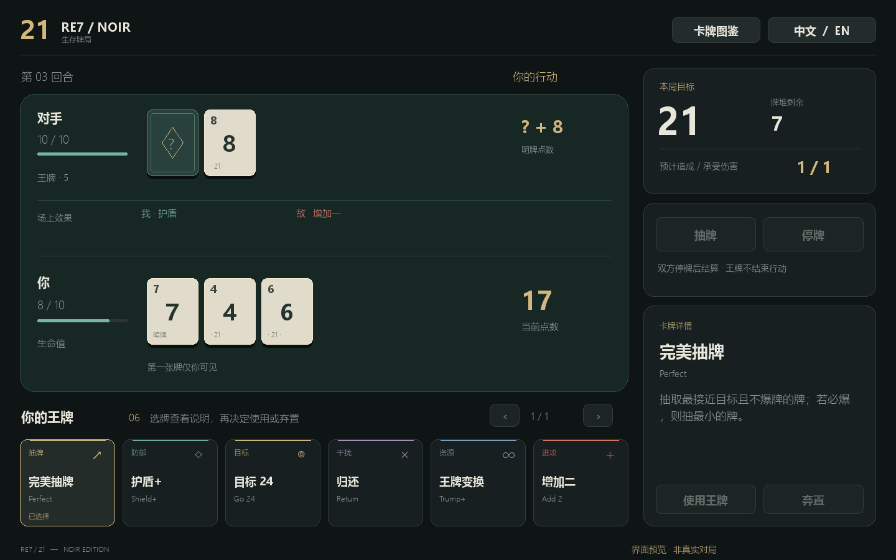
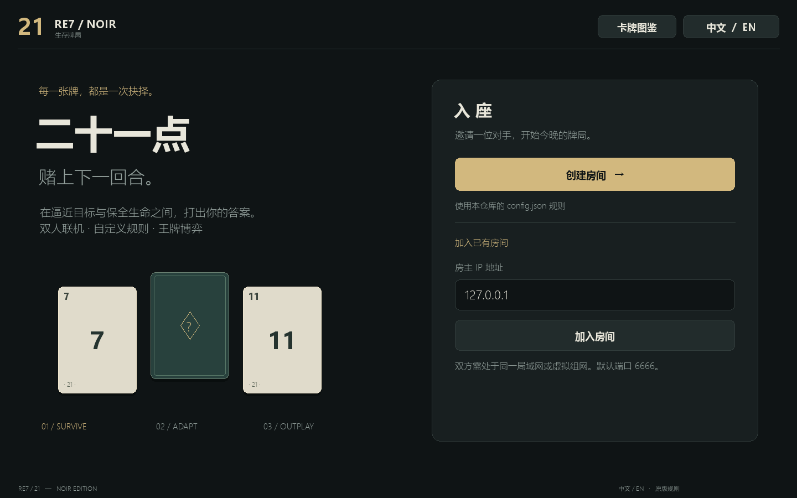

# RE7 · 21 — NOIR

基于 [404elf/RE7_21](https://github.com/404elf/RE7_21) 的独立 UI 改版。深色绿牌桌、暖金配色、中文默认界面与中英切换。游戏规则、卡牌运算、配置读取和服务端沿用原版。




## 开始游戏

Windows 用户可直接运行打包目录中的 `RE7_21_Noir.exe`。同目录下的 `config.json` 由房主加载。

源码运行：安装 Python 3.12 或更新版本，然后双击 `start.cmd`。首次会在本目录建立虚拟环境并安装唯一运行依赖 pygame-ce。也可手动运行：

```powershell
python -m venv .venv
.venv/Scripts/python.exe -m pip install -r requirements.txt
.venv/Scripts/python.exe main.py
```

1. 房主点击「创建房间」。
2. 对手输入房主的局域网 / 虚拟组网 IP，点击「加入房间」。同机测试使用 `127.0.0.1`。
3. 点击「抽牌」或「停牌」。选择王牌后，右侧分别提供「使用王牌」和「弃置」。弃置不触发效果，也不结束行动。
4. 双方停牌后自动结算；游戏结束后双方同意即可再来一局。

右上角切换语言或打开全部 49 张王牌的图鉴。手牌超过 6 张可翻页；窗口可缩放，建议至少 1280 × 800。对手第一张牌在行动阶段隐藏，结算时揭示。IP 支持粘贴和全选。取消等待会关闭本客户端创建的服务端进程。

## 配置与保留范围

- `re7_21.py` 是原仓库源码的逐字节副本，包括原 UI，SHA-256：`d96649c329fb5c80c21246acbe779cc4b56bedbcc96f648468b98696e11fb1e7`。
- `main.py` 仅实现新界面、连接管理、原命令发送和显示。`server.py` 直接调用原服务端，并保持旧版 `__main__.GameState` 序列化名称。
- 保留 `HIT / STAY / TRUMP / DISCARD / REMATCH`、回合编号、端口 6666、0.5 秒操作冷却及全部原版规则。
- `config.json` 和 `presets/` 内五份预设来自原仓库；修改前请备份自己的配置。只有房主的规则生效。
- 只应连接可信局域网 / 虚拟组网中的玩家：原协议使用 pickle，未增加互联网鉴权或加密。未把旧协议直接暴露为网页服务。

## 图鉴与原版实现差异

本次不修复或重平衡以下原有行为。卡牌名称均保留英文内部标识，中文显示单独映射；图鉴中的“图鉴效果”是参考图片的设计说明，不承诺原版已实现该效果。

- `Return` 实际归还自己的最后一张明牌；图中写的是对手。
- `Remove` 实际将对手最后一张明牌放回牌堆；图中写的是移除游戏。
- 原 `use_trump` 创建 `new_trump` 后没有将其加入 `active_trumps`，因此多种场上持续效果无法按图鉴生效。`TARGET`、部分破坏卡等也缺少完整分支；此处没有补写。
- `Waste` 分支包含清除对手场上王牌及重算目标的原有代码；未改动。
- 原服务端没有完整的对手断线广播，客机离开后房主可能仍等待。退出房主客户端会结束其自己创建的房间。
- 原协议未同步房主的王牌桌面上限。客户端将最终可否出牌交由原服务端判定。

这些差异记录在此，是为了避免把 UI 改版变成规则改版。

## 开发与验证

```powershell
.venv/Scripts/python.exe -m unittest discover -s tests -v
.venv/Scripts/python.exe main.py --preview
.venv/Scripts/python.exe main.py --preview --english
powershell -File build.ps1
```

`--preview` 是禁用联机操作、带显著标记的静态 UI 样例。实际游戏使用不带该参数的启动方式。测试覆盖本机两个客户端与原服务端之间的握手、出牌、弃牌、回合结算、重新开局和旧序列化兼容；不替代真实两台设备 / 虚拟组网测试。

无网页托管、无在线账号、无额外卡牌规则。运行依赖为 pygame-ce；PyInstaller 仅用于 Windows 打包。
